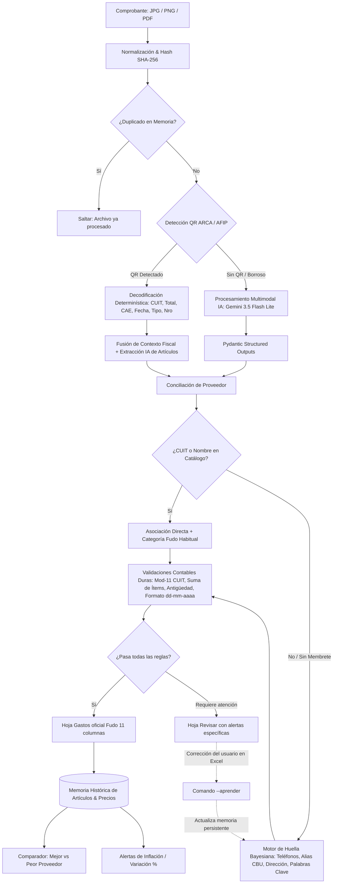

# FudoExtractor v2 🧾⚡

> **Extractor inteligente de comprobantes y facturas para Fudo ERP mediante IA Multimodal, Decodificación Determinística de QR ARCA y Memoria de Huellas.**

[](https://www.python.org/)
[](https://aistudio.google.com/)
[](https://docs.pydantic.dev/)
[](pruebas/unit/)
[](LICENSE)
[](https://github.com/)

---

## 📌 El Problema de Negocio

En el rubro gastronómico y comercial en Argentina, la carga manual de comprobantes de compras y gastos en sistemas de gestión como **Fudo** representa un cuello de botella crítico:

- **Diversidad caótica de formatos:** Facturas electrónicas A/B/C con QR, tiques fiscales térmicos de controlador, remitos manuscritos sin membrete formal, recibos y fotos enviadas por WhatsApp con diferente iluminación y ángulo.
- **Alto costo operativo y error humano:** Tiende a provocar discrepancias en CUITs, fechas invertidas, errores aritméticos entre neto/IVA e importes totales, y demoras de horas por semana para el personal contable.
- **Falta de trazabilidad y descontrol de precios:** Proveedores habituales que cambian listas de precios sin previo aviso y artículos comprados a diferentes distribuidores sin un comparador unificado de precios unitarios.

**FudoExtractor v2** automatiza este proceso de punta a punta: procesa lotes enteros de imágenes (JPG, PNG, PDF), extrae y valida los datos con precisión contable, genera directamente el archivo oficial **`Plantilla-Gastos.xlsx`** de 11 columnas listo para importar en Fudo, y construye un **catálogo histórico analítico de precios** con comparador del mejor proveedor y alertas de aumentos.

---

## 🏛️ Arquitectura del Sistema



---

## 🚀 Características Técnicas Destacadas

### 1. Decodificación Determinística de QR ARCA (ex-AFIP)
- Lee de forma nativa el código QR fiscal de las facturas electrónicas argentinas mediante `zxing-cpp`.
- Decodifica la carga útil en Base64 oficial (`https://www.afip.gob.ar/fe/qr/?p=...`) extrayendo CUIT, fecha, punto de venta, número de factura, importe final y CAE con **100% de precisión matemática**, reduciendo el consumo de tokens y acelerando el tiempo de procesamiento.

### 2. Extracción Multimodal con Structured Outputs
- Integración con el SDK oficial `google-genai` usando **Gemini 3.5 Flash Lite** (con fallback automático a `gemini-3.1-flash-lite` y OpenAI `gpt-4o-mini`).
- Esquema estricto de Pydantic (`ExtraccionComprobante`) que desglosa líneas de artículos (producto, cantidad numérica, unidad de medida, precio unitario e importe), evidencias del tipo de comprobante, datos de pago y huellas visuales.
- Manejo de saturación transitoria (códigos 429 / 503) con reintentos progresivos y backoff exponencial (3s, 6s, 9s).

### 3. Memoria Persistente de Proveedores y Motor de Huellas (*Fingerprint*)
- Base de datos local SQLite con scoring bayesiano (*Noisy-OR*) para comprobantes sin nombre:
  - Teléfonos y números de WhatsApp.
  - CBU, CVU y Alias bancarios.
  - Direcciones físicas y textos preimpresos de talonarios.
  - Términos léxicos frecuentes del rubro.
- **Bucle de Aprendizaje Continuo (`--aprender`):** El usuario puede corregir el Excel generado y ejecutar `aprender.bat`; el sistema absorbe las correcciones y recuerda al proveedor para futuros comprobantes manuscritos.

### 4. Histórico de Precios, Comparador de Proveedores y Alertas de Inflación
- **Normalización inteligente:** Algoritmo que elimina empaques y variantes de bulto (`cajón`, `bolsa`, `pack x 10`) preservando la tipología del producto (por ejemplo `harina 000` vs `harina 0000`).
- **Comparador de Mejor Proveedor:** Identifica qué distribuidor vende cada insumo al menor precio unitario histórico y calcula el sobrecosto incurrido.
- **Monitor de Variaciones (%):** Detecta aumentos bruscos entre compras consecutivas con semáforo de colores.
- **Reporte Analítico en Excel:** Exportación automática a `Historico_Precios.xlsx` con 3 hojas estructuradas (Resumen/Comparador, Alertas de Aumento, Detalle Histórico).

### 5. Interfaz Gráfica de Usuario (GUI de Escritorio)
- Aplicación de escritorio nativa y ligera construida sobre `Tkinter/ttk` (inicio instantáneo, cero dependencias adicionales).
- 5 pestañas operativas:
  1. **📥 Procesar Comprobantes:** Ejecución en hilo secundario con barra de progreso y consola con colores en vivo.
  2. **📊 Histórico de Precios:** Buscador en tiempo real, tabla comparativa de compras e histórico cronológico por producto.
  3. **🚨 Alertas de Aumento:** Detector de inflación con umbral configurable de variación porcentual.
  4. **🏢 Ficha de Proveedores:** Catálogo interactivo de insumos provistos por cada empresa con precios y fechas.
  5. **🧠 Aprender / Evaluar:** Herramientas de absorción de correcciones y benchmarking con un solo clic.

---

## 📊 Evaluación con Datos Reales (Benchmarking)

El sistema fue sometido a una prueba de estrés sobre un banco de **45 comprobantes reales** de un restaurante en operación (facturas electrónicas de distribuidoras, tiques de carnicerías, notas de pedido de panadería, comprobantes manuscritos):

| Métrica | Resultado |
| :--- | :---: |
| **Comprobantes procesados con éxito** | **45 / 45 (100%)** |
| **Proveedores identificados automáticamente** | **35 / 45 (77.8%)** |
| **Comprobantes derivados a revisión contable** | **30 / 45 (66.7%)** *(antigüedad histórica y percepciones)* |
| **Tiempo promedio por comprobante** | **3.5s - 5.0s** |
| **Recuperación ante saturación de cuota** | **100% resuelto sin pérdida de datos** |

---

## 📁 Estructura del Proyecto

```text
fudo-expenses-py-extractor/
├── fudo/                          # Módulos del núcleo del sistema
│   ├── __init__.py
│   ├── catalogo.py                # Cruce difuso contra proveedores y categorías de Fudo
│   ├── config.py                  # Carga de entorno y variables de control
│   ├── esquema.py                 # Esquemas Pydantic y tipado estricto
│   ├── evaluador.py               # Motor de benchmarking y comparación contra gabaritos
│   ├── excel.py                   # Generador de Plantilla-Gastos.xlsx y parser de aprendizaje
│   ├── extractores.py             # Clientes de IA con Structured Outputs y fallback
│   ├── gui.py                     # Interfaz gráfica de escritorio (Tkinter / ttk)
│   ├── huella.py                  # Algoritmo de scoring bayesiano para comprobantes sin nombre
│   ├── imagen.py                  # Preprocesamiento Pillow (downscaling a 1600px, rotación EXIF)
│   ├── memoria.py                 # Capa de persistencia SQLite (proveedores y artículos históricos)
│   ├── ocr_offline.py             # Contingencia sin conexión (EasyOCR / Tesseract)
│   ├── precios.py                 # Analítica de precios, comparador y exportador Excel
│   ├── qr_arca.py                 # Decodificador determinístico de QR AFIP/ARCA con zxing-cpp
│   ├── router.py                  # Árbol de decisiones y pipeline central
│   └── validaciones.py            # Módulo 11 de CUIT, sanitización y formateo de fechas
├── pruebas/                       # Banco de pruebas automatizadas
│   └── unit/                      # Tests unitarios determinísticos (pytest)
│       ├── test_huella.py
│       ├── test_memoria.py
│       ├── test_precios.py
│       ├── test_qr_arca.py
│       └── test_validaciones.py
├── procesador.py                  # Punto de entrada CLI principal
├── crear_plantilla.py             # Generador de plantilla vacía de Fudo
├── iniciar_gui.bat                # Lanzador directo de la interfaz gráfica
├── FudoExtractor.spec             # Especificación de empaquetado para PyInstaller
├── .env.example                   # Plantilla documentada de variables de entorno
├── requirements.txt               # Dependencias de producción
├── requirements-dev.txt           # Dependencias de testing y build
├── LICENSE                        # Licencia MIT
└── README.md                      # Documentación principal
```

---

## 🛠️ Instalación y Uso

### 1. Clonar el repositorio
```bash
git clone https://github.com/fedehda/fudo-expenses-py-extractor.git
cd fudo-expenses-py-extractor
```

### 2. Crear entorno virtual e instalar dependencias
```bash
python -m venv .venv
source .venv/bin/activate  # En Linux/Mac
.\.venv\Scripts\activate   # En Windows

pip install -r requirements.txt
```

### 3. Configurar variables de entorno
Copia el archivo `.env.example` como `.env` e ingresa tu API Key gratuita de [Google AI Studio](https://aistudio.google.com/):
```bash
cp .env.example .env
```

Contenido de `.env`:
```env
GEMINI_API_KEY=tu_api_key_aqui
GEMINI_MODEL=gemini-3.5-flash-lite
GEMINI_MODEL_RESPALDO=gemini-3.1-flash-lite
MAX_DIAS_ANTIGUEDAD=60
PAUSA_ENTRE_TICKETS=1.5
```

---

## 💻 Modos de Ejecución

### Modo Interfaz Gráfica (Recomendado para Usuario Final)
Abre el panel interactivo con visualización de histórico y comparador:
```bash
python procesador.py --gui
# O haciendo doble clic en iniciar_gui.bat
```

### Modo Estándar CLI (Procesar comprobantes)
Coloca las imágenes o PDFs en `input_tickets/` y ejecuta:
```bash
python procesador.py
```
El archivo resultante se guardará en `output_fudo/Gastos_YYYYMMDD_HHMMSS.xlsx`.

### Modo Exportar Histórico de Precios (`--precios`)
Genera el reporte analítico multihioja en Excel con comparador de proveedores y alertas:
```bash
python procesador.py --precios
```
Generará `Historico_Precios_YYYYMMDD_HHMMSS.xlsx`.

### Modo Aprendizaje Continuo (`--aprender`)
Si corregiste proveedores o categorías en el Excel generado:
```bash
python procesador.py --aprender output_fudo/Gastos_20261006_120000.xlsx
```

### Modo Evaluación de Precisión (`--evaluar`)
Para correr benchmarking sobre una carpeta de prueba:
```bash
python procesador.py --evaluar --limite 10
```

### Ejecutar Pruebas Unitarias
```bash
pytest pruebas/unit
```

---

## 📦 Compilación a Ejecutable Portable (Sin Python)

Para distribuir la herramienta a usuarios contables sin necesidad de instalar Python:
```bash
pyinstaller FudoExtractor.spec --noconfirm
```
El ejecutable resultante en `dist/FudoExtractor/` incluye todas las dependencias y scripts batch (`iniciar.bat`, `aprender.bat`, `evaluar.bat`) para uso autónomo en cualquier PC con Windows.

---

## 🔒 Privacidad y Seguridad

- **Sin almacenamiento en la nube de terceros:** Las imágenes solo se transmiten efímeramente para inferencia a la API oficial de Google AI Studio / OpenAI y no se almacenan en servidores externos.
- **Base de datos local:** Toda la memoria de proveedores y señales reside localmente en `memoria.db` (SQLite).
- **Higiene en Control de Versiones:** El archivo `.gitignore` excluye estrictamente claves `.env`, bases de datos SQLite y fotos de comprobantes reales para proteger el secreto fiscal y comercial.

---

## 📄 Licencia

Este proyecto se distribuye bajo la licencia **MIT**. Consulta el archivo [LICENSE](LICENSE) para más detalles.

---

Desarrollado como solución de ingeniería contable aplicada al ecosistema gastronómico argentino.
